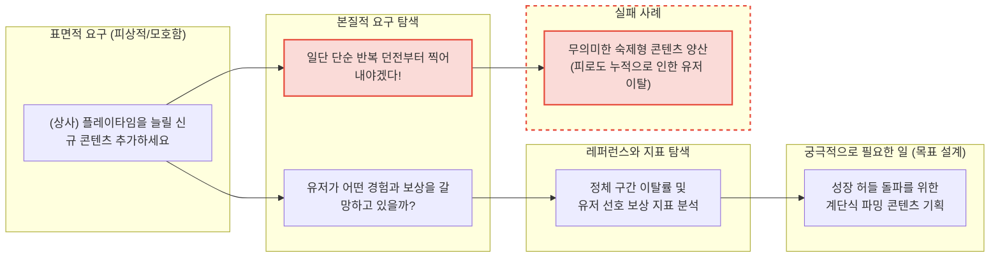
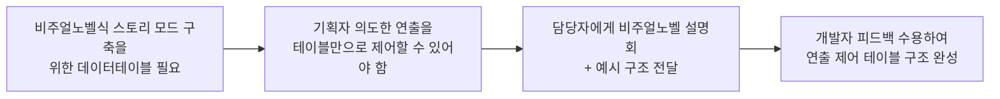
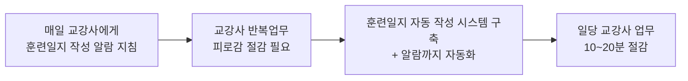

## 왜 게임 콘텐츠 기획자를 하고 싶은가?
혹시 스타크래프트의 유즈맵 **타입문 아레나**를 아십니까?
스타크래프트의 유닛들에 유명 서브컬쳐 IP [타입문]의 캐릭터 이름들을 붙여 싸우는 맵입니다.

 

각 유닛들은 늘 보던 질럿, 마린들이었지만, 그 이름 하나만으로 전혀 다른 캐릭터처럼 다가왔습니다. 그리고 캐릭터마다 구현된 스킬 시스템을 플레이하며 그 일개 유닛은 제게, 플레이어에게 [타입문]의 캐릭터의 화신이 될 수 있었습니다.
설정과 플레이 경험이 어우러져 전혀 다른 세계가 펼쳐졌던 것입니다.

 

저는 여기서 게임과 스토리텔링의 힘을 보았습니다.
그리고 어떻게 이런 즐거운 경험을 많은 사람들에게 줄 수 있을지 삶의 궤적에서 끊임없이 고민하며, 그 결과 게임 콘텐츠 기획의 길로 들어서게 되었습니다.

## 스토리와 설정이 녹아든 콘텐츠로 몰입감을 극대화하는 기획자
제가 게임 개발에서 가장 중요하게 여기는 가치는 **몰입**입니다. 그리고 몰입은 **설득력있는** 설정과 배경에서 나온다고 생각합니다. 

 

이런 생각은 지금까지의 게임 개발에도 녹아들어 있습니다.

|프로젝트|관련 내용|
|:--:|:--|
|스토리플레이 로맨스 판타지 | 플랫폼의 주요 독자층이 선호하는 장르와 고정 유저층(학원 동기)의 선호 콘텐츠가 양립할 수 있도록 로맨스와 전투 양쪽이 모두 매력적이게 되도록 고민을 담아냄|
|인피니티 큐브 헬 | 단순히 큐브를 굴리는 퍼즐 게임이지만, 플레이어가 "어디로 얼마나 가는가", "어디에서 무얼 보는가", "스테이지를 진행하며 이것이 어떤 체험이라 정의하게 할 것인가"를 녹여냄 |
천룡 | 캐릭터 하나하나에 깊은 서사가 담길 수 있도록 용을 이용한 전투라는 게임 시스템 전반과 그 용을 다루는 플레이어의 분신에 대한 깊이있는 스토리 구성을 진행 |

저는 흔한 설정 만드는 공상가가 아닙니다. 설정이 **어떻게 느껴질 것인가**에 대해 설계하는 기획자입니다.

## 요구에 맞는 목표를 설계하는 기획자 
저는 **요구**를 찾아내어 목표를 만든 뒤 작업을 수행하는 사람입니다. 
**요구**는 `"상사가 시켰다"`, `"모바일로 쾌적하게 플레이 할 수 있어야 한다"`와 같은 피상적이고 모호한 것을 말하는 것이 아닙니다. 제가 말하는 요구란 표면 뒤에 숨은 **궁극적으로 필요한 일**입니다.

지금까지 살아오며 해당 프로세스는 항상 적용되어 왔습니다.
아래는 그 사례들입니다.

### 개인 경험

```mermaid
flowchart LR
    A["전역 직후 자전거로<br>국토 종주 결심"] --> B["완주는 의지력이 아닌<br>리스크 관리 위에서 이루어짐"]
    B --> C["외딴 도로에서 자전거 고장<br>대처 프로세스 구축<br>(실제로 그 일이 일어남)"]
    C --> D1["1) 히치하이킹"]
    C --> D2["2) 수리 키트로 자가 수리"]
    C --> D3["3) 자전거 끌고<br>목적지로 이동"]
    C --> D4["4) 자전거 포기,<br>도시로 나갈 방법 찾기"]
    D1 --> E["히치하이킹으로<br>자전거 수리점까지 이동"]

    classDef chosen fill:#0d1830,stroke:#7ff4ff,stroke-width:2px;
    class D1,E chosen;
```

### 기업협약 프로젝트

### 학습매니저

위와 같은 업무 접근 방식으로 과정 운영 효율화와 질적 향상을 모두 잡을 수 있었습니다. 그 결과 제가 운영에 참여한 커리큘럼의 만족도 조사는 지난 기수들 대비 가장 좋은 점수를 받을 수 있었습니다. 

## 빠른 기술 도입에 적극적인 기획자
게임업계는 AI를 포함하여 트렌드와 기술의 변화가 매우 빠르게 일어나는 산업입니다. 저는 항상 **흐름을 인지**하고, **필요한 기술**을 필요한 곳에 적극적으로 활용하는 사람입니다.

아래는 그 사례들입니다.

### 스토리플레이 로맨스 판타지
- 생성형 AI 스테이블 디퓨전

### ICH 3D 퍼즐
- 타일맵

### 학습매니저
- 사전 과정 콘텐츠(크롤링)
- 훈련일지
- 수강생 관리 문서
- 교안 관리/검토
- CSV 기반 업무
- 기록 정리(AI 요약 및 구조화)

!! 미작성 !!
    - 근거 자료 : 학습 매니저 이력(업무 시기에 따른 신기술 확인과 즉각적인 도입을 통한 작업 방식의 변화), 엑셀 자동화, ai 스킬

